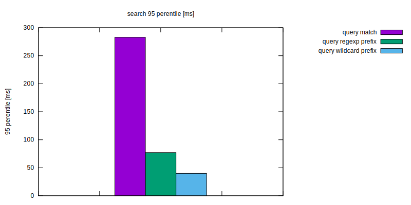
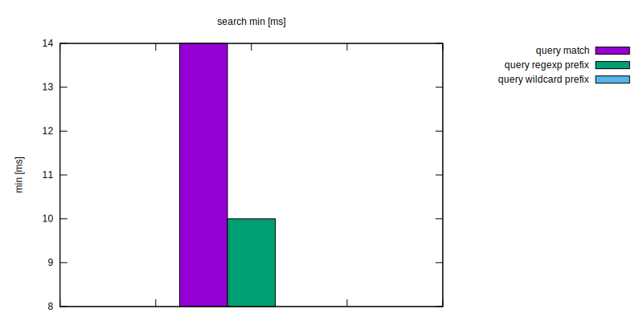
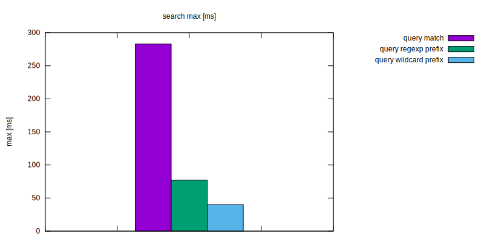

Test Objective
==============

Elastic: Text search: term vs regexp vs wildcard

Results
=======






Usage
=====

docker, make, nodejs are required
```
$ make install  # installs nodejs dependencies
$ make prepare  # start postgres docker container
$ make test     # run tests, run multiple times for bigger data sets
$ make report   # produce charts from test results
$ make purge    # cleanup leftover files produced during tests (eg. databases)
```
