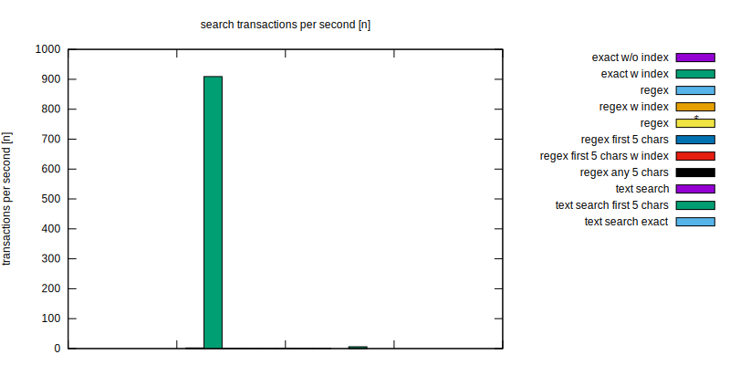
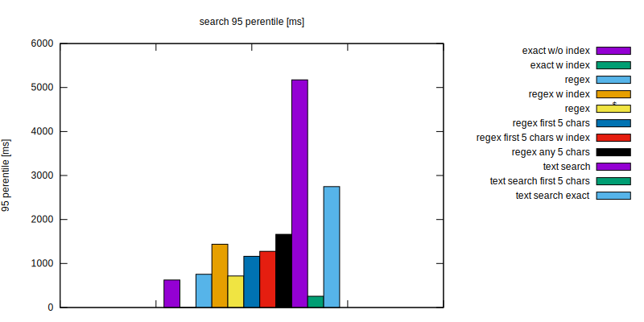

Test Objective
==============

Mongodb text search using regex vs text index

Results
=======





Usage
=====

docker, make, nodejs are required
```
$ make install  # installs nodejs dependencies
$ make prepare  # start mongo docker container
$ make test     # run tests
$ make report   # produce charts from test results
$ make purge    # cleanup leftover files produced during tests (eg. databases)
```
