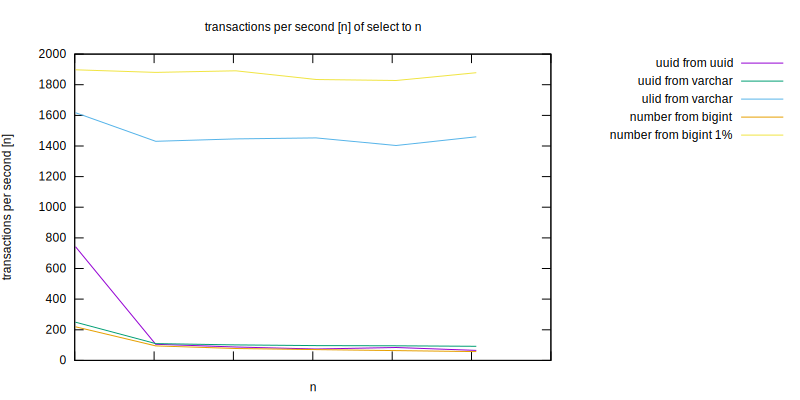
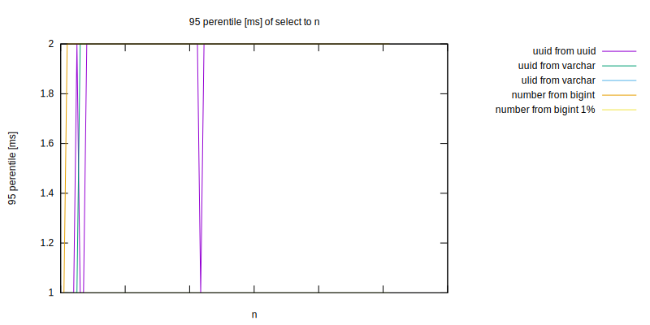
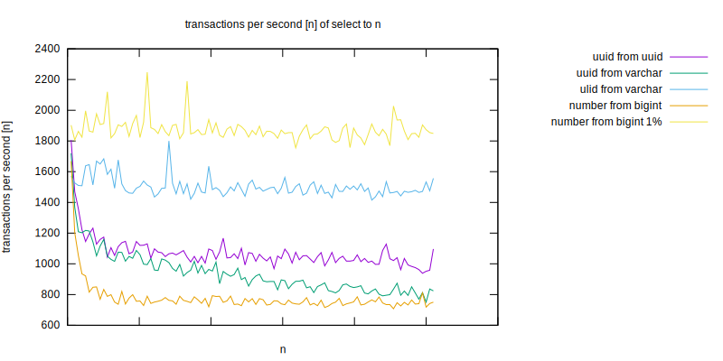

Test Objective
==============

Compare different field types indexes (mainly uuid vs bigint) in terms of insert and select speed using different hardware and table sizes.
Results can be seen as diagrams in report directory, raw results in results directory.

Results
=======

Select random row using index
-----------------------------







[1] - Number from bigint 1% - It selects random row from 1000 biggest values.

Conclusions:
- Poor correlation to size of table (Todo: try on bigger tables)
- Selecting random value from whole table behaves similarly on all field types
- Selecting values from narrow range is significantly better

Todos:
- Test on bigger tables (this requires different hardware because tests were rather slow)
- Retest ulid, maybe it wasn't fully random
- Retest bigint 1% but for bigger sets

Usage
=====

docker, make, nodejs are required
```
$ make install  # installs nodejs dependencies
$ make prepare  # start postgres docker container
$ make test     # run tests, run multiple times for bigger data sets
$ make report   # produce charts from test results
$ make purge    # cleanup leftover files produced during tests (eg. databases)
```
