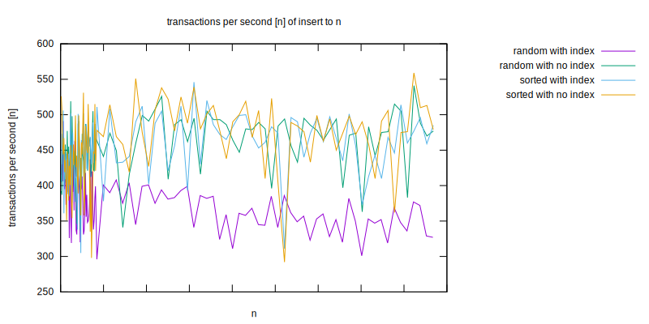
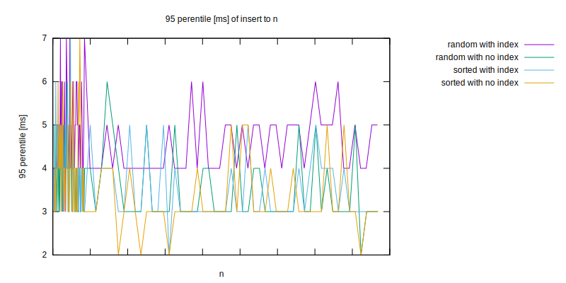
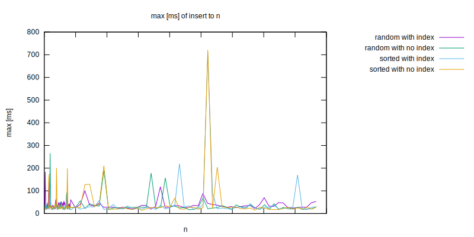

Test Objective
==============

What is the difference between inserting to table with index vs without index?
 a) similar values
 b) random values

Results
=======

* Inserting random values into indexed column seems significantly slower.
* There seems no difference between other types of tested data: random values not indexed, sorted values indexed, sorted values not indexed.
* It seems table size doesn't matter, at least for tested table sizes (~170 milion rows)






Test environment: DigitalOcean droplet 2vcpu, 4GB RAM, 80G SSD

TODO: Double check on different test environment.

Usage
=====

docker, make, nodejs are required
```
$ make install  # installs nodejs dependencies
$ make prepare  # start postgres docker container
$ make test     # run tests, run multiple times for bigger data sets
$ make report   # produce charts from test results
$ make purge    # cleanup leftover files produced during tests (eg. databases)
```
