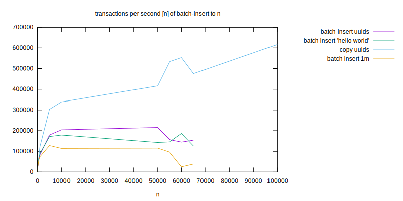
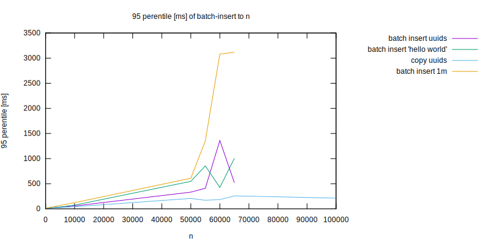
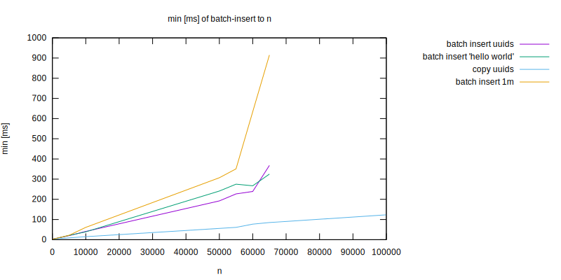
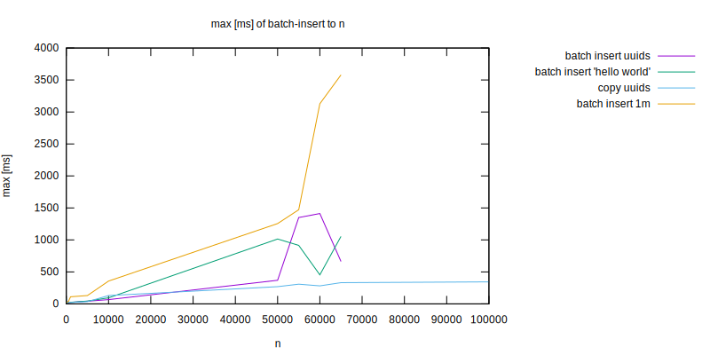

Question
--------

What is the difference between inserting single row vs many rows?

Findings
--------

- The more rows inserted in single statement, the less time it takes per row.
- There's an upper limit of rows inserted at once, above which an error is thrown,
at least in Node.js postgres client. Doesn't occur with `COPY FILE`
- Inserting rows from file is even faster
- As the table size increases, inserts get slower.

Data series:

- batch insert uuids - batch insert random uuids
- batch insert hello world - inserting same static text every time
- batch insert uuidss 1m - random uuids, but into table with 1m records
- copy uuids - `COPY FILE`
- `n` - number of rows inserted at one batch






How to rerun the test
---------------------

Prior requirements: docker, make, nodejs
```
$ make install  # installs nodejs dependencies
$ make prepare  # start postgres docker container
$ make test     # run tests, run multiple times for bigger data sets
$ make purge    # cleanup leftover files produced during tests (eg. databases)
```
