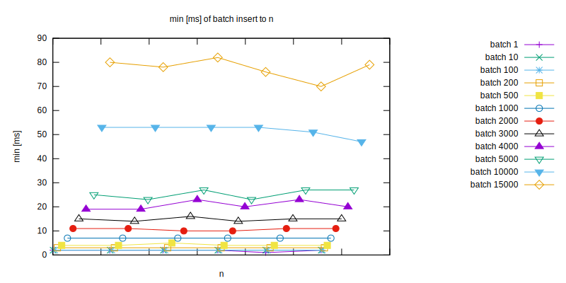

Question
========

What is the difference between inserting single row vs many rows?

Answer
======

Inserting many rows at once is faster than single row.

The more rows inserted in single statement, the less time it takes per row.

With increased number of rows in table, time required to perform insert increases.





How to rerun the test
=====================

Prior requirements: docker, make, nodejs
```
$ make install  # installs nodejs dependencies
$ make prepare  # start postgres docker container
$ make test     # run tests, run multiple times for bigger data sets
$ make report   # produce charts from test results
$ make purge    # cleanup leftover files produced during tests (eg. databases)
```
